# ☸️ Kause

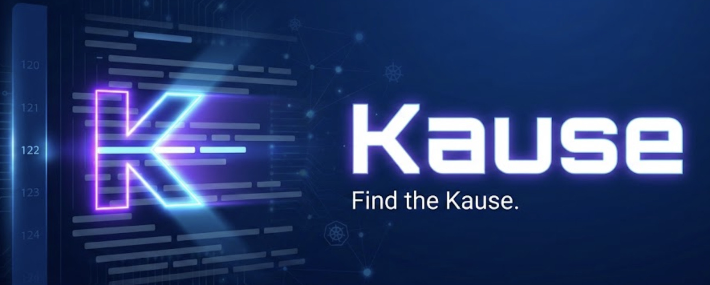

> **K8S-cause: 查明原因，解决停顿。** 您的 AI 智能 SRE 队友。

[](https://goreportcard.com/report/github.com/mark3labs/mcp-go)


[🇬🇧 EN](README_EN.md)

---

## 😫 痛点：为什么选择 Kause？

- **“有没有试过为了一个 `CrashLoopBackOff` 调试两小时，最后发现只是一个拼写错误？”**
- **“需要修复生产环境，但由于害怕复制粘贴错误的 `kubectl patch` 而迟迟不敢动手？”**
- **“淹没在报警信息中，却找不到任何上下文？”**

Kubernetes 很强大，但故障排查通常是手动的、重复的且容易出错的。除了仪表盘，您更需要一个队友。

## 🚀 解决方案：AI 侦探 & 外科医生

**Kause** 不仅仅是一个聊天机器人；它是一个使用模型上下文协议 (MCP) 直接与您的集群交互的 **Agentic System（智能体系统）**。

### ✨ 核心特性

#### 🕵️ AI 侦探 (Sherlock Mode)
Kause 不会让您粘贴日志，而是 **主动去查看**。
- **深度调查**：自动获取 Pod 状态、日志、事件和 YAML 规格。
- **上下文感知**：理解服务依赖关系和集群拓扑。
- **根因分析**：将事件（如 "OOMKilled"）与日志（"Out of memory error"）关联起来，告诉您 *为什么* 发生，而不仅仅是 *发生了什么*。

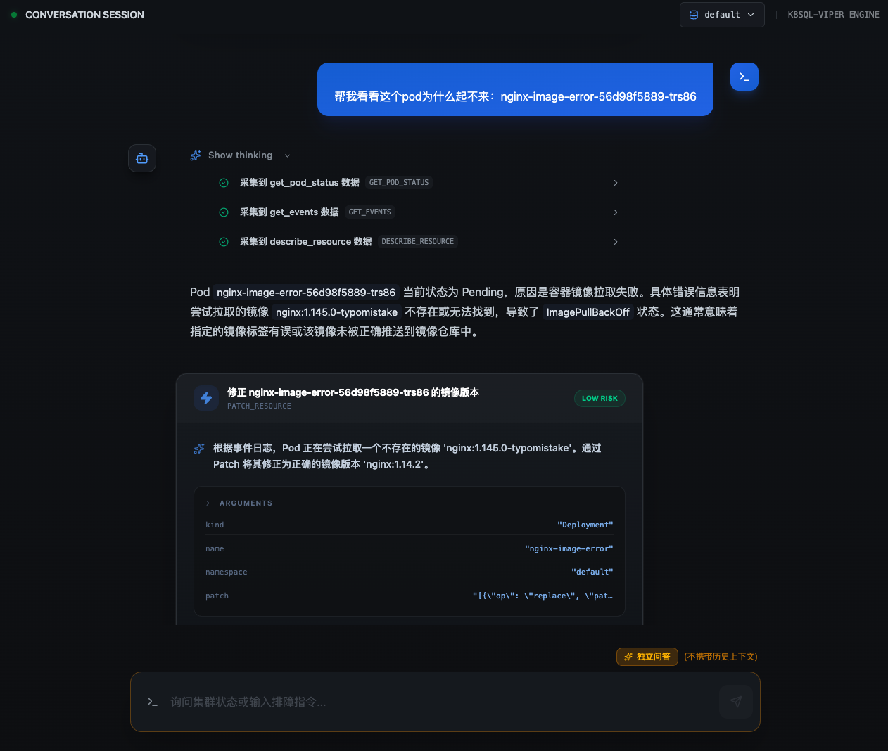

#### 🩺 自动外科医生 (精准修复)
一旦发现问题，Kause 不会只说“修复它”，它会 **为您编写修复方案**。
- **生成 JSON Patch**：生成精准的、符合 RFC 6902 标准的 JSON Patch 来对外科手术般地修改资源。
- **校验**：在提出补丁之前确保其语法正确。

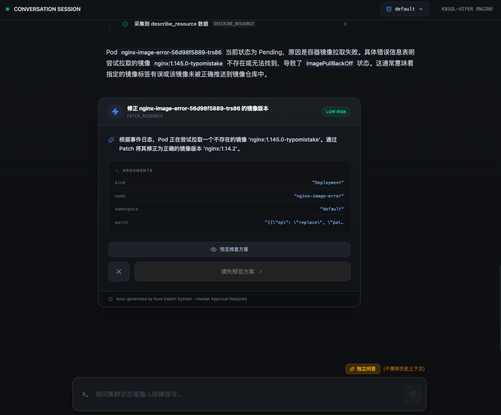

#### 🛡️ 人在回路 (Human-in-the-Loop)
我们相信 **AI 是辅助，而非主宰**。
- **预览修改**：在进行任何写操作之前，像 Git Diff 一样精确预览由于变更。
- **严格审批**：没有您的明确确认，不会应用任何补丁。
- **审计日志**：记录每一次操作。

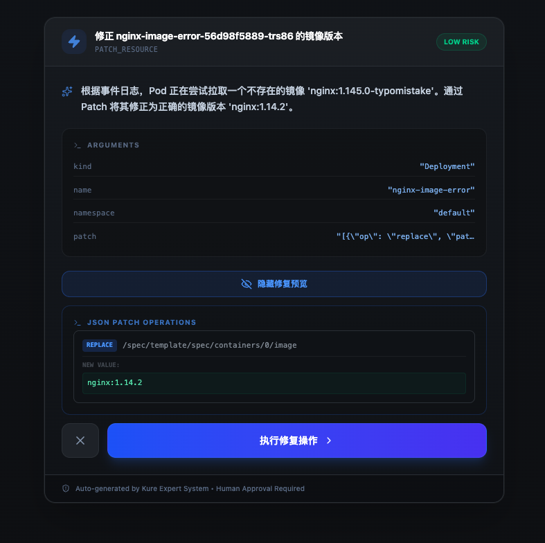

#### ✅ 操作完成
修复应用后，Kause 会自动验证集群状态。

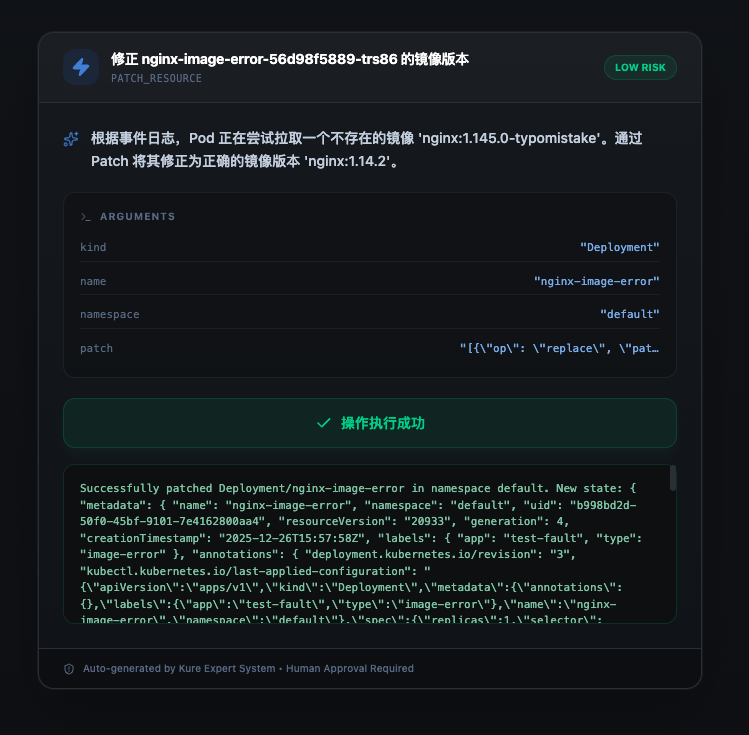
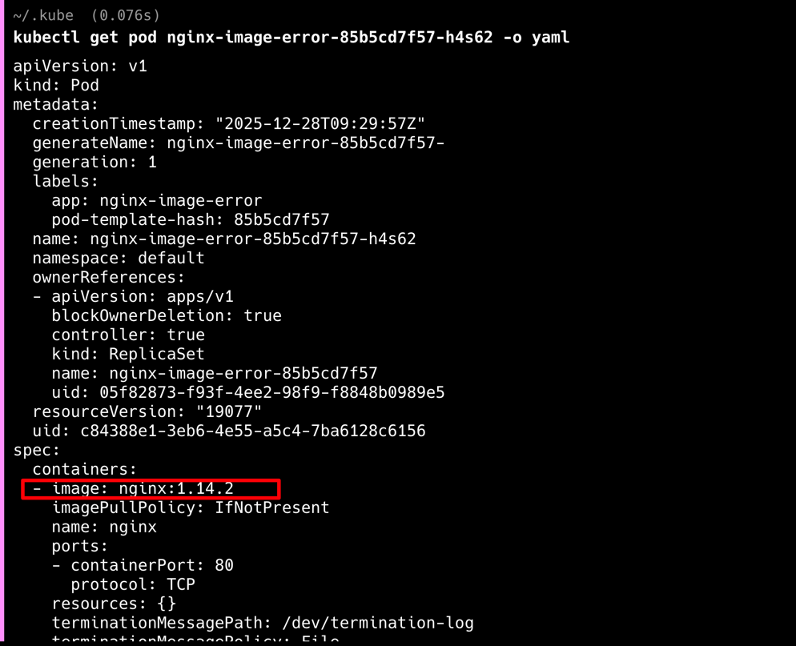

### 故障场景2: Ingress 流量黑洞（路径匹配失误）

**故事背景**：
您正在将 `/api/payment` 流量迁移到新的微服务。

**配置失误**：
在新 Ingress 中配置规则时，您不小心拼错了路径（例如写成了 plural 复数形式）或忘记了 `/api` 前缀，导致**精确匹配失效**。

**后果**：
由于精确匹配未命中，流量没有进入新服务，而是被旧服务的“贪婪正则”（如 `/api/.*`）捕获，导致流量“消失”或进入了错误的服务版本，造成业务看似中断。

**故障模拟 YAML**: [ingress-hijack-final.yaml](mcp-server/examples/ingress-hijack-final.yaml)

**Kause 现场分析**：
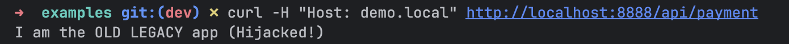
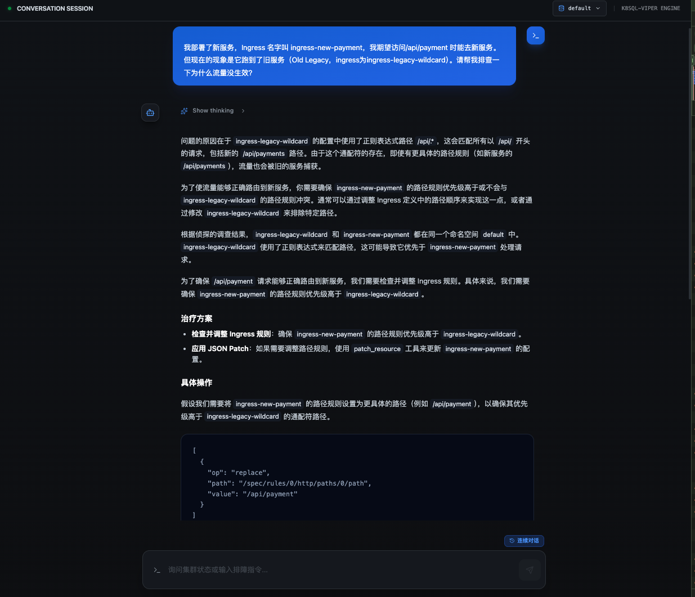
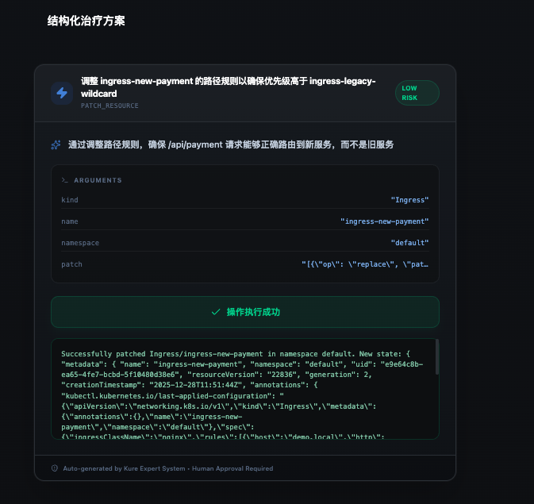
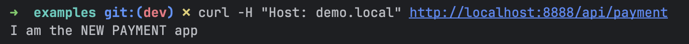

---

## 🏗️ 架构

Kause 采用模块化架构，分离了大脑 (LLM)、身体 (Backend) 和手 (MCP Server).

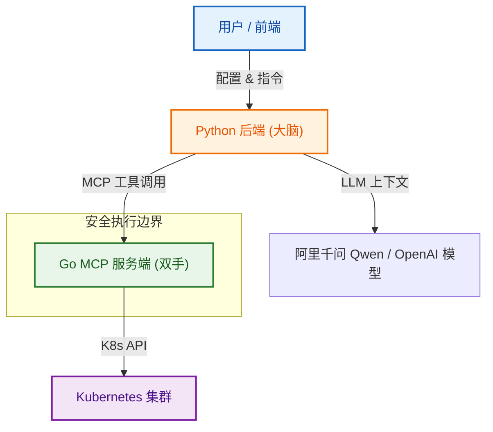

---

## ⚡ 快速开始

### 前置条件
- Docker & Docker Compose
- 一个 Kubernetes 集群 (OrbStack, Minikube, or remote)
- `~/.kube/config` 可访问

### 1. 克隆与安装
```bash
git clone https://github.com/YunMuZhe/Kause.git
cd kause
```

### 2. 配置密钥
在 `backend/` 目录下创建 `.env` 文件：
```bash
cp backend/.env.example backend/.env
# 编辑 backend/.env 并配置您的模型参数 (如 阿里千问/Dashscope, OpenAI)
# APP_LLM__API_KEY=sk-xxx
# APP_LLM__MODEL_NAME=qwen-max
```

### 3. 启动 (使用 Docker Compose)
```bash
docker-compose up --build
```
(注意：此命令会自动构建前端、后端及 MCP Server)

访问 UI：`http://localhost:5173`。

---

## 🤝 贡献
欢迎提交 PR！请查阅我们的 [贡献指南](CONTRIBUTING.md)。

## 📄 许可证
MIT © 2024 Kause Team.
