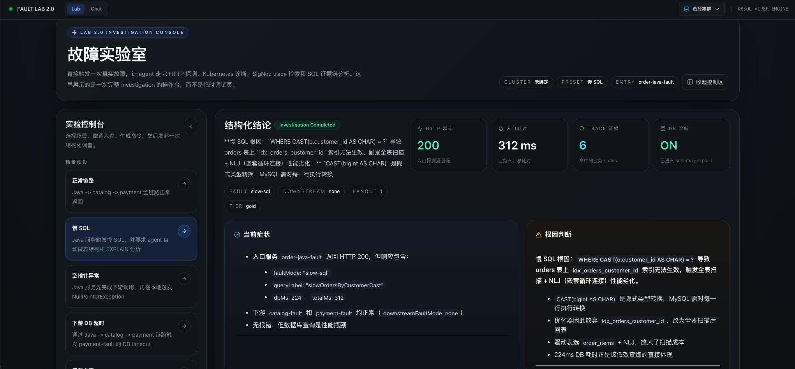
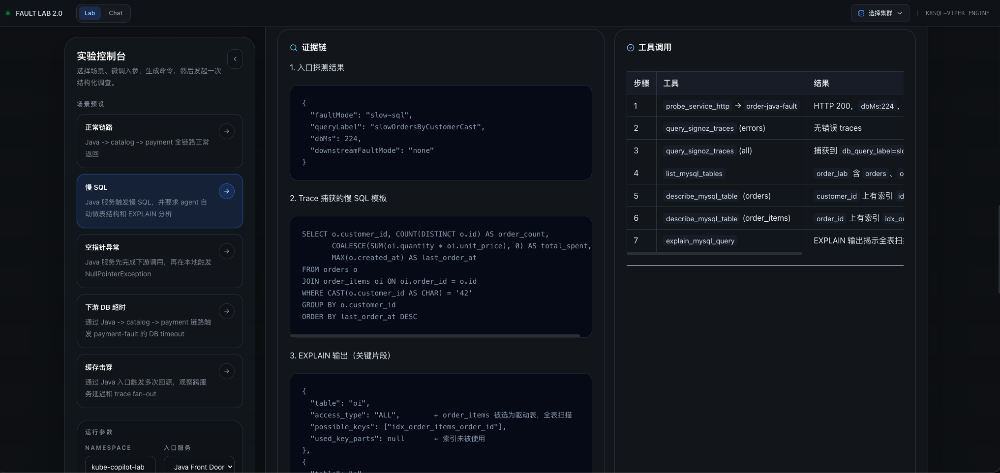
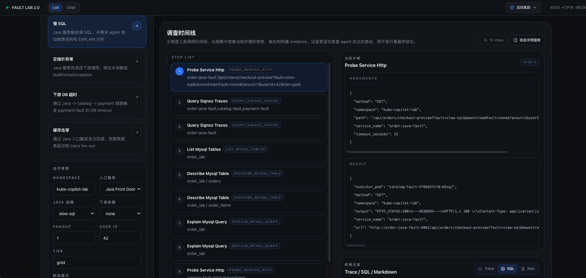
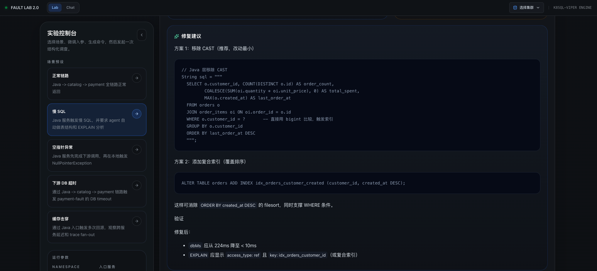
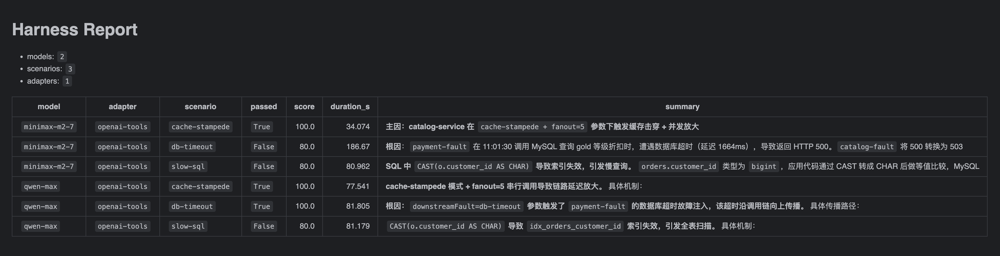
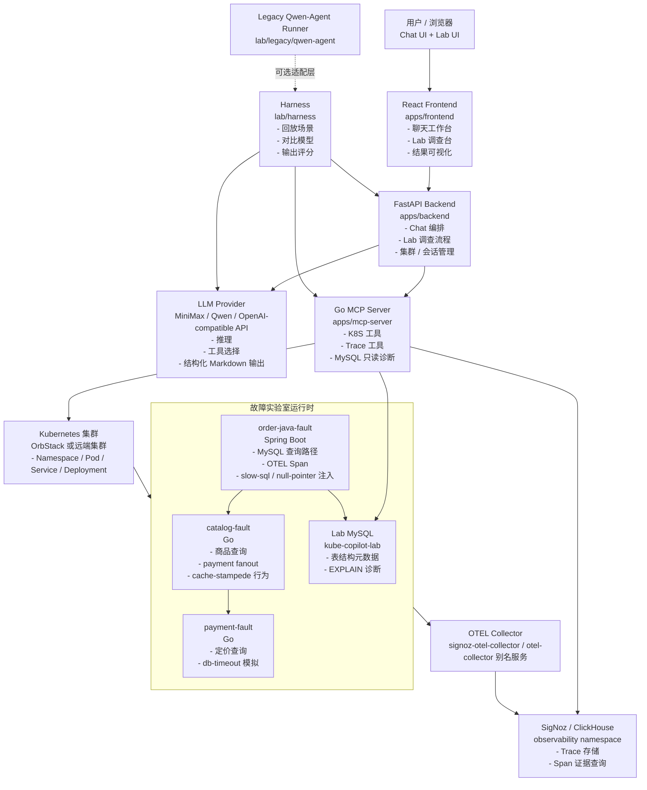

# Kause

[English README](README_EN.md)

Kause 是一个面向 Kubernetes 故障排查的 AI 调查工作台。它把下面几层能力整合到了一起：

- React + FastAPI 的产品界面，支持 Chat 与 Lab 两种工作模式
- 一个 Go 实现的 MCP Server，把 Kubernetes、Trace、MySQL 诊断能力暴露给大模型
- 一套本地故障实验室，包含 Java / Go 微服务、集群内 MySQL、SigNoz 与 OTEL
- 一套 Harness 基准测试层，用于批量跑场景、对比模型、评估 Agent 排查质量

这个仓库已经不只是一个“能跑通的 demo”，而是一套可以持续迭代的实验与验证平台。你可以用它：

- 复现请求级故障场景
- 让 Agent 结合 K8S、日志、Trace、SQL 证据做真实排查
- 对比 MiniMax、Qwen 等模型在同一批故障场景下的表现
- 迭代 Prompt、工具链、证据质量，并用 Harness 做验证闭环

## 界面预览

### Lab 2.0 首页



### 证据链与工具调用



### 调查时间线



### 修复建议



### Harness 示例报告



## 当前能力

### 产品层

- 多集群 Chat 式排障入口
- 独立的 Lab 2.0 调查页面
- FastAPI 编排层负责：
  - 探测业务入口服务
  - 调用 MCP 工具
  - 查询 SigNoz Trace
  - 在出现慢 SQL 证据时自动触发表结构与 `EXPLAIN` 分析

### MCP 诊断层

- Kubernetes 资源、状态、事件查询
- Pod 状态与日志抓取
- 从集群内发起 HTTP 探测
- SigNoz Trace 查询
- MySQL 元数据查询与只读 `EXPLAIN` 诊断

### 故障实验室

- `order-java-fault`：Spring Boot 入口服务
- `catalog-fault`：Go 服务
- `payment-fault`：Go 下游依赖
- `lab-mysql`：带种子数据的 MySQL
- SigNoz + OTEL Collector 可观测链路

### Benchmark / Harness 层

- 基于场景的批量运行
- 多模型矩阵执行
- Markdown + JSON 结果产物
- 基于根因、证据链、Trace、工具路径的结构化评分

## 这些排查是怎么实现出来的

慢 SQL、空指针、下游超时这类结论并不是单靠自然语言生成出来的，而是建立在一套明确的调查链路之上。以慢 SQL 场景为例，系统依赖了下面这些能力来逐步收敛证据：

### 1. 入口 HTTP 探测

后端会先探测业务入口服务，例如：

- `order-java-fault /api/orders/checkout-preview`
- `catalog-fault /api/catalog/items`
- `payment-fault /internal/pricing`

在慢 SQL 场景里，入口探测响应里会直接返回：

- `faultMode`
- `queryLabel`
- `dbMs`
- `totalMs`
- `downstreamFaultMode`

这就是首页 KPI、当前症状，以及后续 trace / SQL 诊断的第一层线索来源。

### 2. SigNoz Trace 检索

在拿到入口响应后，Lab 调查会继续查询 SigNoz Trace，重点看：

- 当前入口路由是否有慢调用
- 是否出现异常 span
- 是否能捕捉到 `db.query.label`、`db.query.template`
- Java -> catalog -> payment 的链路有没有异常扩散

这部分会体现在界面的以下区域：

- `Trace 证据`
- 证据链里的 trace 结果
- 调查时间线中的 `query_signoz_traces`

### 3. MySQL 表结构与 EXPLAIN

如果 trace 或入口响应里已经明确暴露出 SQL 相关线索，比如：

- `slowOrdersByCustomerCast`
- `db.query.template`
- `db.query.label`
- 明显的 `dbMs` 异常

那么 Agent 不会停在“怀疑数据库慢”，而是继续拿只读 DB 证据：

- `list_mysql_tables(database=order_lab)`
- `describe_mysql_table(database=order_lab, table_name=orders)`
- `describe_mysql_table(database=order_lab, table_name=order_items)`
- `explain_mysql_query(database=order_lab, sql=...)`

这部分能力会直接驱动 SQL 面板、EXPLAIN 片段，以及最终的索引失效判断。

### 4. Kubernetes 资源与日志上下文

虽然慢 SQL 场景最后收敛到数据库层，但整个系统依然会保留 K8S 上下文能力，用于其他场景或交叉验证：

- Pod / Deployment 状态
- Events
- Pod Logs
- 集群内 curl 探测

这保证了它不会把所有问题都误判成 SQL 问题。比如 `null-pointer` 场景会优先走 Java 异常定位，`db-timeout` 会沿着 Java -> Go -> dependency 的链路收敛。

### 5. 结构化结论与修复建议

当 HTTP、Trace、SQL、K8S 证据都拿齐后，后端会把结果组织成固定的几个 section：

- 当前症状
- 工具调用
- 证据链
- 根因判断
- 修复建议

最终结果不会停留在一段原始 Markdown，而是会被前端重新组织为结构化调查界面：

- 结论卡片
- KPI 指标
- 时间线
- 证据面板
- 修复建议代码块

## 慢 SQL 场景的实际调查路径

以当前慢 SQL 场景为例，系统的调查路径如下：

1. 调用 `order-java-fault` 入口接口，拿到 `faultMode=slow-sql`、`queryLabel=slowOrdersByCustomerCast`、`dbMs=224`
2. 查询 SigNoz Trace，确认慢点在数据库查询而不是下游 Go 服务
3. 列出 `order_lab` 的表，并检查 `orders` / `order_items` 的结构与索引
4. 对真实 SQL 模板执行 `EXPLAIN`
5. 发现 `CAST(o.customer_id AS CHAR)` 让 `idx_orders_customer_id` 无法命中
6. 发现 `order_items` 作为驱动表放大扫描成本
7. 输出两类修复建议：
   - 改写 Java 查询，移除 `CAST`
   - 增加覆盖排序的复合索引

最终会稳定收敛到以下判断：

- 根因不是“服务报错”
- 也不是“下游依赖异常”
- 而是一个可以被 `EXPLAIN` 直接证明的应用层 SQL 退化问题

## 整体架构



## 仓库结构

```text
apps/
  backend/        FastAPI 编排层与 API
  frontend/       React / Vite 前端
  mcp-server/     Go MCP Server，提供 K8S / Trace / SQL 工具
  mcp-ssh-server/ 可选的 SSH 类 MCP 辅助组件

lab/
  deployments/    Lab 服务的 K8S 清单
  observability/  SigNoz 安装与配置
  services/       Go + Spring Boot 故障服务
  scenarios/      Benchmark 场景定义
  harness/        可重复执行的评测运行器
  legacy/         旧版 Qwen-Agent 接入

runtime/
  compose/        本地 compose 运行时数据
```

## Quick Start

推荐分成两条主线来理解：

1. 先把产品控制面拉起来：`frontend + backend + MCP`
2. 再把故障实验室拉起来：`K8S + SigNoz + services`

如果你想完整体验整条链路，两部分都需要启动。

### 1. 环境准备

- Docker / Docker Compose
- Node.js 20+
- Python 3.10+
- Go 1.22+（如果你要本地编译 MCP）
- `kubectl`
- 一个可访问的 Kubernetes 集群
- 至少一套模型 API Key

### 2. 配置后端模型信息

```bash
cp ./apps/backend/.env.example ./apps/backend/.env
```

最少需要配置：

```env
APP_LLM__API_KEY=...
APP_LLM__BASE_URL=https://api.minimax.chat/v1
APP_LLM__MODEL_NAME=MiniMax-M2.7
```

如果后续要跑 Qwen 的 Harness 矩阵，也可以额外配置：

```env
DASHSCOPE_API_KEY=...
```

### 3. 启动产品控制面

最快方式是直接使用 Docker Compose：

```bash
docker compose up --build
```

这会启动：

- `apps/frontend`，默认访问地址是 [http://localhost:5173](http://localhost:5173)
- `apps/backend`
- `apps/mcp-server`
- 产品侧本地 compose MySQL

### 4. 为 OrbStack 构建 Lab 服务镜像

如果你的 K8S 运行时使用的是 OrbStack Docker Engine，建议把镜像直接构建到对应 context：

```bash
docker context use orbstack
docker build -t kube-cluster-copilot/catalog-fault:latest ./lab/services/catalog-fault
docker build -t kube-cluster-copilot/payment-fault:latest ./lab/services/payment-fault
docker build -t kube-cluster-copilot/order-java-fault:latest ./lab/services/order-java-fault
```

如果你不想切全局 context，也可以：

```bash
docker --context orbstack build -t kube-cluster-copilot/catalog-fault:latest ./lab/services/catalog-fault
docker --context orbstack build -t kube-cluster-copilot/payment-fault:latest ./lab/services/payment-fault
docker --context orbstack build -t kube-cluster-copilot/order-java-fault:latest ./lab/services/order-java-fault
```

### 5. 在 Kubernetes 中安装 SigNoz

```bash
helm repo add signoz https://charts.signoz.io
helm repo update
helm upgrade --install signoz signoz/signoz \
  --namespace observability \
  --create-namespace \
  -f ./lab/observability/signoz/values.yaml \
  --wait \
  --timeout 30m

kubectl apply -f ./lab/observability/signoz/otel-collector-service.yaml
```

本地访问 SigNoz：

```bash
kubectl -n observability port-forward svc/signoz 3301:8080
```

浏览器打开：

- [http://127.0.0.1:3301](http://127.0.0.1:3301)

### 6. 部署故障实验室

```bash
kubectl apply -k ./lab/deployments/k8s/base

kubectl -n kube-copilot-lab rollout status deploy/lab-mysql
kubectl -n kube-copilot-lab rollout status deploy/catalog-fault
kubectl -n kube-copilot-lab rollout status deploy/payment-fault
kubectl -n kube-copilot-lab rollout status deploy/order-java-fault
```

### 7. 触发几个典型故障场景

```bash
kubectl -n kube-copilot-lab exec deploy/order-java-fault -- sh -lc \
  'curl -sS "http://order-java-fault:8082/api/orders/checkout-preview?fault=slow-sql&downstreamFault=none&fanout=1&userId=42&tier=gold"'

kubectl -n kube-copilot-lab exec deploy/order-java-fault -- sh -lc \
  'curl -sS "http://order-java-fault:8082/api/orders/checkout-preview?fault=null-pointer&downstreamFault=none&fanout=1&userId=42&tier=gold"'

kubectl -n kube-copilot-lab exec deploy/order-java-fault -- sh -lc \
  'curl -sS "http://order-java-fault:8082/api/orders/checkout-preview?fault=none&downstreamFault=db-timeout&fanout=1&userId=42&tier=gold"'

kubectl -n kube-copilot-lab exec deploy/catalog-fault -- sh -lc \
  'curl -sS "http://catalog-fault:8080/api/catalog/items?fault=cache-stampede&fanout=5&tier=gold"'
```

### 8. 打开 Lab 页面

前端入口：

- [http://localhost:5173](http://localhost:5173)

切换到 `Lab` 模式后，可以直接使用内置预设：

- `slow-sql`
- `null-pointer`
- `db-timeout`
- `cache-stampede`

### 9. 运行 Harness 基准测试

列出场景：

```bash
./lab/harness/run.sh --list-scenarios
```

执行单个场景：

```bash
./lab/harness/run.sh --scenario slow-sql
```

执行主场景矩阵：

```bash
./lab/harness/run.sh \
  --scenario slow-sql \
  --scenario null-pointer \
  --scenario db-timeout \
  --scenario cache-stampede \
  --model-config lab/harness/models.yaml
```

产物默认输出到：

```text
lab/harness/output/
```

## 推荐日常使用路径

如果你当前是在迭代 Agent 本身，比较推荐这个顺序：

1. 启动 `frontend + backend`
2. 确认 `observability` 与 `kube-copilot-lab` 正常
3. 在 Lab 页面复现一个场景
4. 去 SigNoz 查看 Trace
5. 调整 Prompt、工具或 UI
6. 对受影响场景重新跑 Harness

这样可以把整个项目一直锚定在“可重复、可验证”的证据链上，而不是停留在一次性的演示。

## 后续规划

### 近期

- 打磨核心场景的 Benchmark 基线
- 在模型额度耗尽时提供更稳的 Harness 汇总结果
- 继续提升 Lab UI 与调查报告的产品感
- 补齐 GitHub 发布用截图与仓库说明

### 下一阶段

- 在前端加入多模型对比视图
- 引入更多 Agent Framework 对比，而不只是一条 `openai-tools` 路径
- 增加 Benchmark 趋势历史与回归检测
- 强化集群 / 会话生命周期与可观测组件安装脚本

### 更后面

- 接入告警触发式故障入口
- 自动化 Postmortem 与修复建议流程
- GitHub / GitLab 代码上下文 MCP 集成
- 打通 “检测 -> 调查 -> 建议 -> 验证” 的闭环

## 相关文档

- [apps/README.md](apps/README.md)
- [lab/README.md](lab/README.md)
- [lab/observability/signoz/README.md](lab/observability/signoz/README.md)
- [lab/harness/README.md](lab/harness/README.md)
