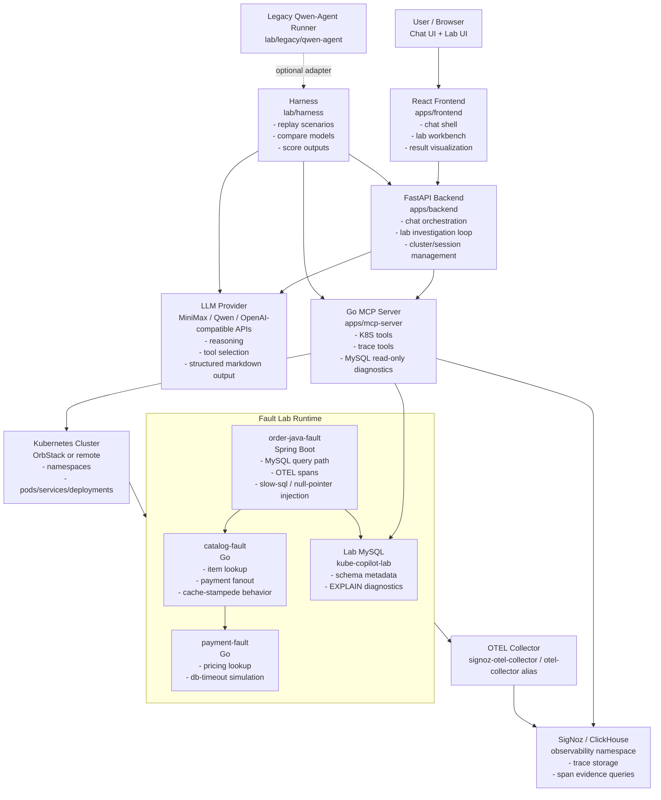

# Kause

Kause is an AI-assisted Kubernetes incident investigation workspace. It combines:

- a React/FastAPI product surface for chat and lab-style investigations
- a Go MCP server that exposes Kubernetes, trace, and MySQL diagnostics as tools
- a local fault lab with Java + Go services, in-cluster MySQL, and SigNoz
- a harness layer for repeatable benchmark runs across models and agent styles

This repository is already past the “toy demo” stage. You can use it to:

- trigger realistic request-level failure scenarios
- let an agent investigate with K8S, traces, logs, and SQL evidence
- compare MiniMax / Qwen style models on the same scenarios
- iterate on prompts, tools, and evidence quality with measurable feedback

## Current Capabilities

### Product layer

- Multi-cluster chat-style troubleshooting UI
- Dedicated Lab 2.0 page for structured incident investigation
- FastAPI orchestration layer that:
  - probes live services
  - calls MCP tools
  - queries SigNoz traces
  - drives SQL diagnostics when slow-query evidence appears

### MCP diagnostics layer

- Kubernetes resource and event inspection
- Pod status and log retrieval
- HTTP probing from inside the cluster
- SigNoz trace queries
- MySQL metadata and `EXPLAIN` tools for slow SQL analysis

### Fault lab

- `order-java-fault`: Spring Boot entry service
- `catalog-fault`: Go service
- `payment-fault`: Go dependency service
- `lab-mysql`: seeded MySQL with `orders` / `order_items`
- SigNoz + OTEL collector integration

### Benchmark / harness layer

- Scenario-driven benchmark runs
- Model matrix execution
- Structured Markdown + JSON artifacts
- Scoring against root-cause, evidence, trace, and tool-path expectations

## Architecture



## Repository Layout

```text
apps/
  backend/        FastAPI orchestration and APIs
  frontend/       React/Vite product UI
  mcp-server/     Go MCP server for K8S / trace / SQL diagnostics
  mcp-ssh-server/ Optional SSH-oriented MCP helper

lab/
  deployments/    K8S manifests for lab services
  observability/  SigNoz install assets
  services/       Go + Spring Boot fault services
  scenarios/      Benchmark scenario definitions
  harness/        Repeatable benchmark runner
  legacy/         Older Qwen-Agent integration

runtime/
  compose/        Local compose persistence
```

## Quick Start

There are really two main paths:

1. bring up the product control plane (`frontend + backend + MCP`)
2. bring up the fault lab (`K8S + SigNoz + services`)

If you want the full workflow, do both.

### 1. Prerequisites

- Docker / Docker Compose
- Node.js 20+
- Python 3.10+
- Go 1.22+ if you want to build MCP locally
- `kubectl`
- a reachable Kubernetes cluster
- one or more model API keys

### 2. Configure backend model access

```bash
cp ./apps/backend/.env.example ./apps/backend/.env
```

At minimum, set:

```env
APP_LLM__API_KEY=...
APP_LLM__BASE_URL=https://api.minimax.chat/v1
APP_LLM__MODEL_NAME=MiniMax-M2.7
```

If you also want Qwen in harness matrix runs, add:

```env
DASHSCOPE_API_KEY=...
```

### 3. Start the product stack

The quickest path is Docker Compose:

```bash
docker compose up --build
```

This starts:

- `apps/frontend` on `http://127.0.0.1:5173`
- `apps/backend`
- `apps/mcp-server`
- local compose MySQL for the product app

### 4. Build the lab service images for OrbStack

If your K8S runtime uses the OrbStack Docker engine, build into that context:

```bash
docker context use orbstack
docker build -t kube-cluster-copilot/catalog-fault:latest ./lab/services/catalog-fault
docker build -t kube-cluster-copilot/payment-fault:latest ./lab/services/payment-fault
docker build -t kube-cluster-copilot/order-java-fault:latest ./lab/services/order-java-fault
```

If you prefer not to switch the global context:

```bash
docker --context orbstack build -t kube-cluster-copilot/catalog-fault:latest ./lab/services/catalog-fault
docker --context orbstack build -t kube-cluster-copilot/payment-fault:latest ./lab/services/payment-fault
docker --context orbstack build -t kube-cluster-copilot/order-java-fault:latest ./lab/services/order-java-fault
```

### 5. Install SigNoz in Kubernetes

```bash
helm repo add signoz https://charts.signoz.io
helm repo update
helm upgrade --install signoz signoz/signoz \
  --namespace observability \
  --create-namespace \
  -f ./lab/observability/signoz/values.yaml \
  --wait \
  --timeout 30m

kubectl apply -f ./lab/observability/signoz/otel-collector-service.yaml
```

Access the UI:

```bash
kubectl -n observability port-forward svc/signoz 3301:8080
```

Open:

- [http://127.0.0.1:3301](http://127.0.0.1:3301)

### 6. Deploy the fault lab

```bash
kubectl apply -k ./lab/deployments/k8s/base

kubectl -n kube-copilot-lab rollout status deploy/lab-mysql
kubectl -n kube-copilot-lab rollout status deploy/catalog-fault
kubectl -n kube-copilot-lab rollout status deploy/payment-fault
kubectl -n kube-copilot-lab rollout status deploy/order-java-fault
```

### 7. Trigger a few known scenarios

```bash
kubectl -n kube-copilot-lab exec deploy/order-java-fault -- sh -lc \
  'curl -sS "http://order-java-fault:8082/api/orders/checkout-preview?fault=slow-sql&downstreamFault=none&fanout=1&userId=42&tier=gold"'

kubectl -n kube-copilot-lab exec deploy/order-java-fault -- sh -lc \
  'curl -sS "http://order-java-fault:8082/api/orders/checkout-preview?fault=null-pointer&downstreamFault=none&fanout=1&userId=42&tier=gold"'

kubectl -n kube-copilot-lab exec deploy/order-java-fault -- sh -lc \
  'curl -sS "http://order-java-fault:8082/api/orders/checkout-preview?fault=none&downstreamFault=db-timeout&fanout=1&userId=42&tier=gold"'

kubectl -n kube-copilot-lab exec deploy/catalog-fault -- sh -lc \
  'curl -sS "http://catalog-fault:8080/api/catalog/items?fault=cache-stampede&fanout=5&tier=gold"'
```

### 8. Open the Lab UI

Open the frontend at:

- [http://127.0.0.1:5173](http://127.0.0.1:5173)

Then switch to `Lab` mode and use the built-in presets:

- `slow-sql`
- `null-pointer`
- `db-timeout`
- `cache-stampede`

### 9. Run harness benchmarks

List scenarios:

```bash
./lab/harness/run.sh --list-scenarios
```

Run one:

```bash
./lab/harness/run.sh --scenario slow-sql
```

Run the main matrix:

```bash
./lab/harness/run.sh \
  --scenario slow-sql \
  --scenario null-pointer \
  --scenario db-timeout \
  --scenario cache-stampede \
  --model-config lab/harness/models.yaml
```

Artifacts land in:

```text
lab/harness/output/
```

## Recommended Daily Workflow

If you are iterating on the agent:

1. bring up `frontend + backend`
2. ensure `observability` and `kube-copilot-lab` are healthy
3. reproduce one scenario from the Lab page
4. inspect SigNoz traces
5. tune prompt / tools / UI
6. rerun harness for the affected scenarios

That keeps the project grounded in repeatable evidence instead of one-off demos.

## Current Roadmap

### Near-term

- Harden the benchmark baseline for all core scenarios
- Add failure-tolerant harness summaries when a model API quota is exhausted
- Improve production polish for the Lab UI and investigation reports
- Publish a clean GitHub-ready repository narrative and screenshots

### Next

- Add side-by-side model comparison views in the frontend
- Add framework comparison beyond the current `openai-tools` path
- Add benchmark trend history and regression detection
- Tighten cluster/session lifecycle and observability setup scripts

### Later

- Alert-triggered incident entrypoints
- Automated postmortem and remediation suggestion flows
- GitHub / GitLab code-context MCP integration
- Closed-loop “detect -> investigate -> recommend -> validate” workflows

## Related Docs

- [apps/README.md](apps/README.md)
- [lab/README.md](lab/README.md)
- [lab/observability/signoz/README.md](lab/observability/signoz/README.md)
- [lab/harness/README.md](lab/harness/README.md)
