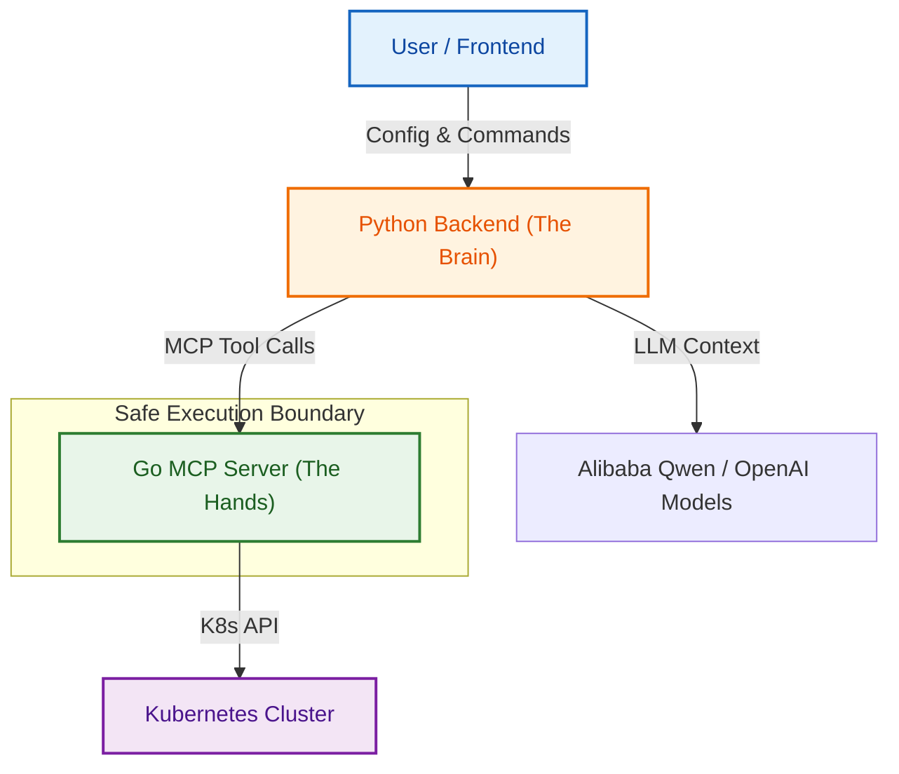

# ☸️ Kause


> **K8S-cause: Find the cause, fix the pause.** Your AI-Powered SRE Teammate.

[](https://goreportcard.com/report/github.com/mark3labs/mcp-go)


[🇨🇳 中文文档](README.md)

---

## 😫 The Pain: Why Kause?

- **"Ever spent 2 hours debugging a `CrashLoopBackOff` only to find a typo?"**
- **"Need to fix production but terrified of copy-pasting the wrong `kubectl patch`?"**
- **"Drowning in alerts but starving for context?"**

Kubernetes is powerful, but troubleshooting it is often manual, repetitive, and error-prone. You need more than a dashboard; you need a teammate.

## 🚀 The Solution: AI Detective & Surgeon

**Kause** isn't just a chatbot; it's an **Agentic System** that interacts directly with your cluster using the Model Context Protocol (MCP).

### ✨ Key Features

#### 🕵️ AI Detective (Sherlock Mode)
Instead of asking you to paste logs, Kause **goes and looks for itself**.
- **Deep Investigation**: Automatically fetches Pod status, Logs, Events, and YAML specs.
- **Context-Aware**: Understands service dependencies and cluster topology.
- **Root Cause Analysis**: Correlates events (e.g., "OOMKilled") with logs ("Out of memory error") to tell you *why*, not just *what*.


#### 🩺 Auto-Surgeon (Precisely Fix It)
Once the problem is found, Kause doesn't just say "fix it"; it **writes the fix for you**.
- **JSON Patch Generation**: Generates precise, RFC 6902 compliant JSON Patches to modify resources surgically.
- **Validation**: Ensures patches are syntactically correct before proposing them.


#### 🛡️ Human-in-the-Loop (Safety First)
We believe in **AI assistance, not AI dominance**.
- **Preview Before Apply**: See exactly what will change (Git-style Diff) before any write operation happens.
- **Strict Approval**: No patch is applied without your explicit confirmation.
- **Audit Logs**: Every action is recorded.


#### ✅ Operation Complete
The fix is applied, and Kause verifies the cluster state.


### Scenario 2: Ingress Hijacking (Path Matching Error)

**Story**:
You are migrating `/api/payment` traffic to a new microservice.

**Misconfiguration**:
When configuring the new Ingress rules, you typo the path (e.g., using plural `payments` instead of `payment`) or forget the `/api` prefix, causing **exact match failure**.

**Consequence**:
Because the specific rule doesn't match, traffic falls through to the legacy service's "greedy regex" (e.g., `/api/.*`). The requests are "hijacked" by the old service, causing silent failures or version mismatches.

**Simulation YAML**: [ingress-hijack-final.yaml](mcp-server/examples/ingress-hijack-final.yaml)

**Kause Investigation**:


---

## 🏗️ Architecture

Kause uses a modular architecture separating the Brain (LLM), the Body (Backend), and the Hands (MCP Server).



---

## ⚡ Quick Start

### Prerequisites
- Docker & Docker Compose
- A Kubernetes cluster (OrbStack, Minikube, or remote)
- `~/.kube/config` accessible

### 1. Clone & Setup
```bash
git clone https://github.com/your-username/kube-cluster-copilot.git
cd kube-cluster-copilot
```

### 2. Configure Secrets
Create a `.env` file in `backend/`:
```bash
cp backend/.env.example backend/.env
# Edit backend/.env and add your LLM API Key (e.g., Qwen/Dashscope, OpenAI)
# APP_LLM__API_KEY=sk-xxx
# APP_LLM__MODEL_NAME=qwen-max
```

### 3. Launch
```bash
docker-compose up --build
```

Access the UI at `http://localhost:5173`.

---

## 🤝 Contributing
We love PRs! Please check out our [Contributing Guide](CONTRIBUTING.md).

## 📄 License
MIT © 2024 Kube Cluster Copilot Team.
